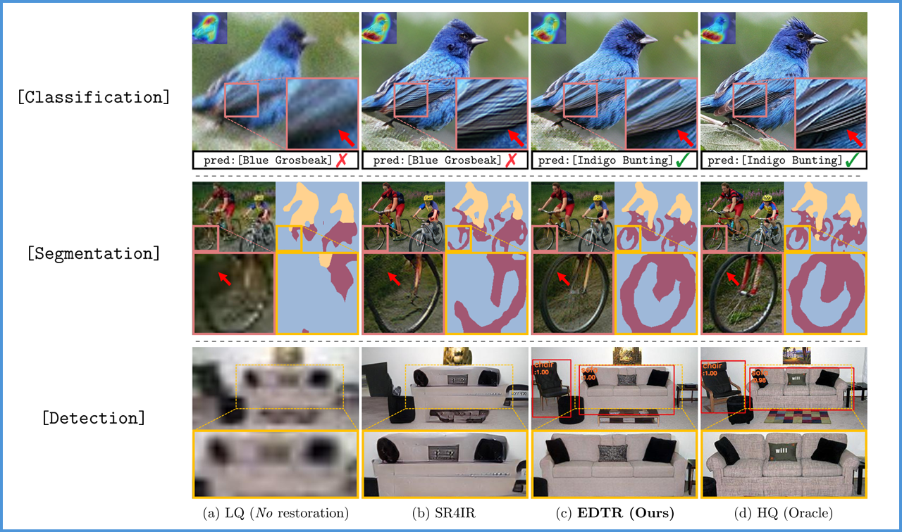
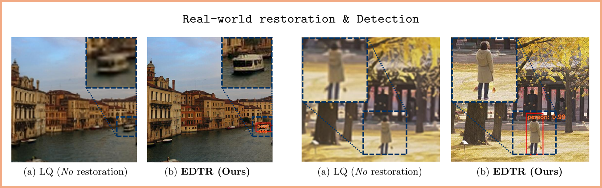

## Exploiting Diffusion Prior for Task-driven Image Restoration [ICCV 2025]

[*Paper*](https://www.arxiv.org/abs/2507.22459)
<!-- | [Project Page](https://0x3f3f3f3fun.github.io/projects/diffbir/) -->

[Jaeha Kim](https://jaehakim97.github.io/), [Junghun Oh](https://cv.snu.ac.kr/index.php/students/), [Kyoung Mu Lee](https://cv.snu.ac.kr/index.php/kmlee/)

*Seoul Nataional University, Korea*

:bookmark_tabs: **TL;DR**: We propose a diffusion-based image restoration method that benefits high-level vision tasks.

<p align="center">
    
</p>

<p align="center">
    
</p>

## <a name="update"></a>:loudspeaker: Update

- **2025.09.01**: The code is released.

## <a name="installation"></a>:gear: Installation

Our code has been tested with **PyTorch 2.2.2** and **CUDA 11.8**.

```shell
conda create -n edtr python=3.10
conda activate edtr
conda install pytorch==2.2.2 torchvision==0.17.2 torchaudio==2.2.2 pytorch-cuda=11.8 -c pytorch -c nvidia
pip install -r requirements.txt
python setup.py
```

#### Weights

Download the pre-trained weights for [Stable Diffusion v2.1](https://huggingface.co/stabilityai/stable-diffusion-2-1-base) and place them in the `weights/` directory.

You can also download the weights using the following command:

```shell
wget https://huggingface.co/stabilityai/stable-diffusion-2-1-base/resolve/main/v2-1_512-ema-pruned.ckpt --no-check-certificate
```

#### Datasets

We use [CUB200](https://www.kaggle.com/datasets/wenewone/cub2002011?select=CUB_200_2011) dataset for classification, and [VOC2012](https://www.kaggle.com/datasets/gopalbhattrai/pascal-voc-2012-dataset) dataset for segmentation and detection.
(The download link is not official, but it is from Kaggle, as the official link often works slowly.)

Download the `archive.zip` file by clicking the "Download" button in the upper-right corner, then place it in the `datasets/source` directory. After that, execute the following commands:

```shell
python datasets/preprocess/cub200.py  # for CUB200
python datasets/preprocess/voc2012.py  # for VOC2012
```

This will automatically extract the zip file and reorganize the dataset to fit our code.

For evaluation, we use a synthetic degraded image set. You can download the datasets from [here](https://drive.google.com/drive/folders/1T6jIG_7g7bxuXtN0AN4y9hkRdMazopsu?usp=sharing).

Please place the degraded CUB200 dataset at `datasets/source/CUB200/val-deg` and the VOC2012 dataset at `datasets/source/VOC/VOCdevkit/VOC2012/JPEGImages*-deg`.

## <a name="pretrained_models"></a>:floppy_disk: Pretrained Models

We provide pretrained EDTR models and comparison methods used in our paper. All models are finetuned on task-specific datasets; CUB-200 for classification, and VOC2012 for both segmentation and detection.

Please download the folder and place it in the proper `experiments/` directory. For example, for EDTR model for detection, place the `007_edtr-s4` folder in `experiments/det/voc2012/`.

:warning: If you want to use the EDTR or DiffBIR models, please download the SwinIR-Pre model first. Its weights are required for both models.

| Model Name | Components | Classification | Segmentation | Detection |
| :---------: | :----------: | :----------: | :----------: | :----------: |
| SwinIR-Pre (*Necessary for EDTR, DiffBIR*) | SwinIR | [download](https://drive.google.com/drive/folders/14dwwZcopQZT38cQSmbocWIcTAhTWGQwJ?usp=sharing) | [download](https://drive.google.com/drive/folders/1kV_YR8XhVFvRs8Un0TRd5YX0ozt5rs9x?usp=sharing)<br> | [download](https://drive.google.com/drive/folders/1ZMrUN979ztSEICI15ckm2t4osK-eGkhn?usp=sharing) |
| EDTR | ControlNet, Decoder, Task Network  | [download](https://drive.google.com/drive/folders/1ixzwST08z-GSzHTwlEq4bbLqaNLjuX67?usp=sharing) | [download](https://drive.google.com/drive/folders/1HdB_W4EDKSdF_xAumeYH-08GxsqxtbQR?usp=sharing)<br> | [download](https://drive.google.com/drive/folders/1RdoqT-WBW4Ob2Y-5SgNampBqIPuXmw63?usp=sharing) |
| DiffBIR | ControlNet, Task Network | [download](https://drive.google.com/drive/folders/1Y0oJF5jdfUH7HZTEurS8ebYUmD7O_QWS?usp=sharing) | [download](https://drive.google.com/drive/folders/1-c5PPW4WmsuPI3c-vIjlzYZRN4KakWg8?usp=sharing)<br> | [download](https://drive.google.com/drive/folders/1RjF5KgWmWMsEJ1y1Cc7zmpifv3gY5ekY?usp=sharing) |
| Oracle, No-restoration | Task Network | [download](https://drive.google.com/drive/folders/1gADdsLerO7Fp7JpFg_6eq__D2E2xnfoV?usp=sharing) | [download](https://drive.google.com/drive/folders/1OFcGZ7BCpIQtKExCT_0GlzW0wz2mCxDS?usp=sharing)<br> | [download](https://drive.google.com/drive/folders/1cofnSOjRwMjJRNCZdKDEJec213dDK7ti?usp=sharing) |
| SwinIR-SR4IR | SwinIR, Task Network | [download](https://drive.google.com/drive/folders/10px0ydE1CIlxcoRdjDpLSJSCp4xAPIdn?usp=sharing) | [download](https://drive.google.com/drive/folders/1zu0avJSQYfYKFWbCEtLXq4aCC9M-wH1e?usp=sharing)<br> | [download](https://drive.google.com/drive/folders/1_5x-gTgyADNjeQqZh8bHKf_i1OFRX10n?usp=sharing) |


## <a name="inference"></a>:rocket: Inference

Below are example inference commands for EDTR in detection.

*NOTE*: You can find all the inference commands, including those for comparison methods, in the [script](script.sh).

### Detection

```shell
CUDA_VISIBLE_DEVICES=0 accelerate launch --main_process_port 4177 main/det/test_edtr.py --config configs/det/voc2012/test/007_edtr-s4.yaml --save-img
```

### Real-world Detection

You need to update the image path in the [config](https://github.com/JaehaKim97/EDTR-READY/blob/821f8dc93f5649701e8d6b96e4152848e4af126f/configs/det/voc2012/test/008_edtr-s4-RW.yaml#L106) to your own image path.

*NOTE*: Since our model has been trained on a relatively smaller dataset (VOC2012 dataset with 5.7k samples) compared to those commonly used in the restoration field, its restoration performance is not yet optimal. We plan to release the EDTR model, trained on a much larger detection dataset (e.g., COCO), as soon as possible!

```shell
CUDA_VISIBLE_DEVICES=0 accelerate launch --main_process_port 4177 main/det/real-world/test_edtr-real.py --config configs/det/voc2012/test/008_edtr-s4-RW.yaml
```

## <a name="train"></a>:wrench: Train

Please download the [codeformer_swinir.ckpt](https://huggingface.co/lxq007/DiffBIR-v2/resolve/main/codeformer_swinir.ckpt) and place it in the `weights/` directory.

*NOTE*: Below are the example training commands for EDTR in detection. You can find all kinds of training commands in the [script](script.sh).

*NOTE*: We recommend using a GPU with at least 40GB\*4 or 80GB\*2 of memory due to the large model size.

1. Training pre-restoration model:
    
    ```shell
    CUDA_VISIBLE_DEVICES=0,1 accelerate launch --main_process_port 4177 main/det/train_swinir-pre.py --config configs/det/voc2012/train/002_swinir-pre.yaml
    ```

2. Training EDTR model:

    ```shell
    CUDA_VISIBLE_DEVICES=0,1,2,3 accelerate launch --main_process_port 4177 main/det/train_edtr.py --config configs/det/voc2012/train/007_edtr-s4.yaml
    ```

## :star: Citation

Please cite us if our work is useful for your research.

```
@inproceedings{kim2025exploiting,
    title={Exploiting Diffusion Prior for Task-driven Image Restoration},
    author={Kim, Jaeha and Oh, Junghun and Lee, Kyoung Mu},
    booktitle={Proceedings of the IEEE/CVF international conference on computer vision},
    year={2025}
}
```

## :clap: Acknowledgement

This code is based on [DiffBIR](https://github.com/XPixelGroup/DiffBIR). We greatly appreciate their awesome work!

## :e-mail: Contact

If you have any questions, please feel free to contact with me at `jhkim97s2@gmail.com`.
