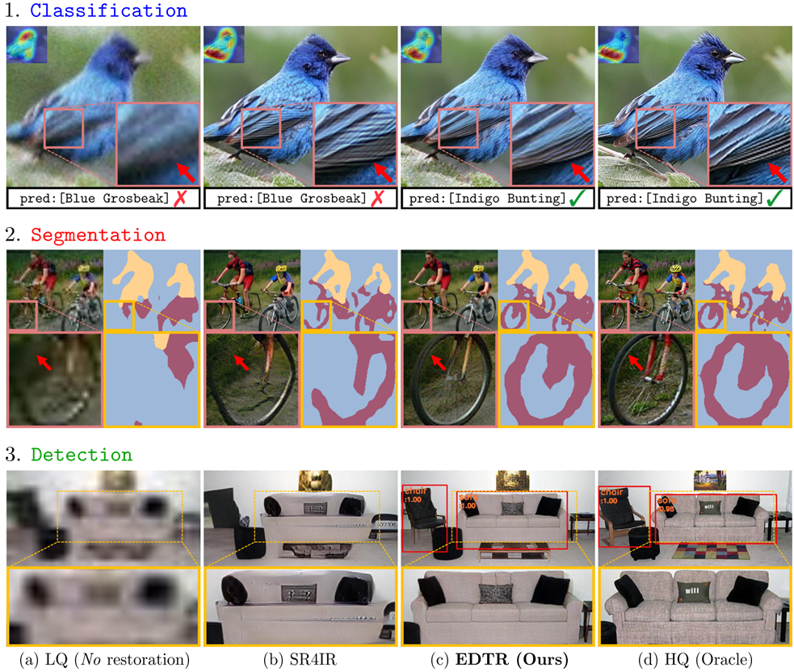

## Exploiting Diffusion Prior for Task-driven Image Restoration [ICCV 2025]

[*Paper*](https://www.arxiv.org/abs/2507.22459)

[Jaeha Kim](https://jaehakim97.github.io/), [Junghun Oh](https://cv.snu.ac.kr/index.php/students/), [Kyoung Mu Lee](https://cv.snu.ac.kr/index.php/kmlee/)

*Seoul Nataional University, Korea*

:bookmark_tabs: **TL;DR**: We propose a diffusion-based image restoration method that benefits high-level vision tasks.

<p align="center">
    
</p>

#### Real-world demo results (detection)

| Low-quality inputs | EDTR results |
|---------------|---------------|
|  |  |
|  |  |
|  |  |

Instructions are provided below. Try it with your own images! :smile:

## <a name="update"></a>:loudspeaker: Update

- **2025.09.26**: Release the real-world EDTR detection model and demo examples. The code has also been simplified.  
- **2025.09.01**: The code is released.

## <a name="installation"></a>:gear: Installation

Our code has been tested with **PyTorch 2.2.2** and **CUDA 11.8**.

```shell
conda create -n edtr python=3.10
conda activate edtr
conda install pytorch==2.2.2 torchvision==0.17.2 torchaudio==2.2.2 pytorch-cuda=11.8 -c pytorch -c nvidia
pip install -r requirements.txt
python setup.py
```

Note that it will automatically download the pre-trained [Stable Diffusion v2.1](https://huggingface.co/stabilityai/stable-diffusion-2-1-base) weights.

## <a name="quick_start"></a>:rocket: Quick start

1. Download the pre-trained EDTR model for real-world detection from [**here**](https://drive.google.com/drive/folders/1ddQKHqMy_h6fOu-Rency39J0-xUg7pQ0) and place it in the `weights/` directory.

2. Run the following command:

```shell
CUDA_VISIBLE_DEVICES=0 python demo.py --input inputs/demo --output results/demo
```

The results will be saved in `results/demo/`.

*NOTE*: You can also use your own images as input, but we recommend keeping the input image size below *512×512*.

The default size of restored images is set so that the longer axis is 512, but you can set a custom upscaling ratio with the `--scale` option.

If you encounter an out-of-GPU-memory error, try using the `--vae-encoder-tiled` and `--cldm-tiled` options.

## <a name="inference"></a>:desktop_computer: Inference

Below are the inference instructions for reproducing the results reported in our main manuscript.

#### Datasets (validation)

We use the [CUB-200-2011](https://www.vision.caltech.edu/datasets/cub_200_2011/) dataset for classification and the [PASCAL VOC2012](https://www.robots.ox.ac.uk/~vgg/projects/pascal/VOC/) dataset for segmentation and detection.

For evaluation, we generate a synthetic degraded image set derived from these datasets.

You can download our processed (degraded) versions [here](https://drive.google.com/drive/folders/1T6jIG_7g7bxuXtN0AN4y9hkRdMazopsu?usp=sharing), or generate following this [instruction](assets/val-data-generation-instruction.md).

If you download our processed versions, please unzip the file and place the degraded datasets under `datasets/source`, so the structure looks like: `datasets/source/CUB200` and `datasets/source/VOC`.

#### Pretrained Models

We provide pretrained models for EDTR and other comparison methods used in our main manusript.

Please unzip the file and place it in the proper `experiments/` directory. For example, for EDTR model for detection, place the `007_edtr-s4` folder in `experiments/det/voc2012/`.

| Model Name | Classification (CUB200) | Segmentation (VOC2012) | Detection (VOC2012) |
| :---------: | :----------: | :----------: | :----------: |
| EDTR | [download](https://drive.google.com/drive/folders/1ixzwST08z-GSzHTwlEq4bbLqaNLjuX67?usp=sharing) | [download](https://drive.google.com/drive/folders/1HdB_W4EDKSdF_xAumeYH-08GxsqxtbQR?usp=sharing)<br> | [download](https://drive.google.com/drive/folders/1RdoqT-WBW4Ob2Y-5SgNampBqIPuXmw63?usp=sharing) |
| Oracle, No-restoration,<br> SR4IR, DiffBIR |  [download](https://drive.google.com/drive/folders/1gADdsLerO7Fp7JpFg_6eq__D2E2xnfoV?usp=sharing) | [download](https://drive.google.com/drive/folders/1OFcGZ7BCpIQtKExCT_0GlzW0wz2mCxDS?usp=sharing)<br> | [download](https://drive.google.com/drive/folders/1cofnSOjRwMjJRNCZdKDEJec213dDK7ti?usp=sharing) |

#### Command

You can evaluate the pre-trained EDTR detection model with the following command:

```shell
CUDA_VISIBLE_DEVICES=0 accelerate launch --main_process_port 4177 main/det/test_edtr.py --config configs/det/voc2012/test/007_edtr-s4.yaml --save-img
```

*NOTE*: You can find all the inference commands, including those for comparison methods, in the [script](script.sh).

## <a name="train"></a>:wrench: Train

*NOTE*: We recommend using a GPU setup with at least **40GB\*4** or **80GB\*2** of memory due to the large model size. In our experiments, we used either 4×A6000 GPUs or 2×H100 GPUs.

#### <a name="datasets"></a>Datasets

| Classification | Segmentation | Detection |
| :----------: | :----------: | :----------: |
| [CUB200 (Kaggle)](https://www.kaggle.com/datasets/wenewone/cub2002011?select=CUB_200_2011) | [VOC2012 (Kaggle)](https://www.kaggle.com/datasets/gopalbhattrai/pascal-voc-2012-dataset) | [VOC2012 (Kaggle)](https://www.kaggle.com/datasets/gopalbhattrai/pascal-voc-2012-dataset) |
| - | - | [COCO2017](https://cocodataset.org/#download) |

For downloading the CUB200 and VOC2012 datasets, we recommend using the Kaggle links provided, as the official servers can sometimes be slow or unavailable.

Download the `archive.zip` file by clicking the "Download" button in the upper-right corner and selecting "Download dataset as zip" (Kaggle login required).

Then, place the file in the `datasets/source/` directory and run the following commands:

```shell
python datasets/preprocess/cub200.py  # for CUB200
python datasets/preprocess/voc2012.py  # for VOC2012
```

These scripts will automatically extract the zip files and reorganize the datasets to match our code.

:warning: Since the downloaded folder names are the same for CUB200 and VOC2012, process them one at a time:
1. Download CUB200, then run the preprocessing command for CUB200.
2. Download VOC2012, then run the preprocessing command for VOC2012.

*NOTE*: For training EDTR model for real-world detection, please refer [this](assets/real-world-recipe.md) for more details.

#### Pretrained models

Please download the [codeformer_swinir.ckpt](https://huggingface.co/lxq007/DiffBIR-v2/resolve/main/codeformer_swinir.ckpt) and place it in the `weights/` directory. (It is used to initialize the SwinIR model, and the link is provided by [DiffBIR](https://github.com/XPixelGroup/DiffBIR).)

#### Command

Below are the example training commands for EDTR in detection. 

1. Training pre-restoration model:
    
    ```shell
    CUDA_VISIBLE_DEVICES=0,1 accelerate launch --main_process_port 4177 main/det/train_swinir-pre.py --config configs/det/voc2012/train/002_swinir-pre.yaml
    ```

2. Training EDTR model:

    ```shell
    CUDA_VISIBLE_DEVICES=0,1,2,3 accelerate launch --main_process_port 4177 main/det/train_edtr.py --config configs/det/voc2012/train/007_edtr-s4.yaml
    ```

*NOTE*: You can find all kinds of training commands in the [script](script.sh).

## :star: Citation

Please cite us if our work is useful for your research.

```
@inproceedings{kim2025exploiting,
    title={Exploiting Diffusion Prior for Task-driven Image Restoration},
    author={Kim, Jaeha and Oh, Junghun and Lee, Kyoung Mu},
    booktitle={Proceedings of the IEEE/CVF international conference on computer vision},
    year={2025}
}
```

## :clap: Acknowledgement

This code is based on [DiffBIR](https://github.com/XPixelGroup/DiffBIR) and [SR4IR](https://github.com/JaehaKim97/SR4IR). We greatly appreciate their awesome works!

## :e-mail: Contact

If you have any questions, please feel free to contact with me at `jhkim97s2@gmail.com`.
